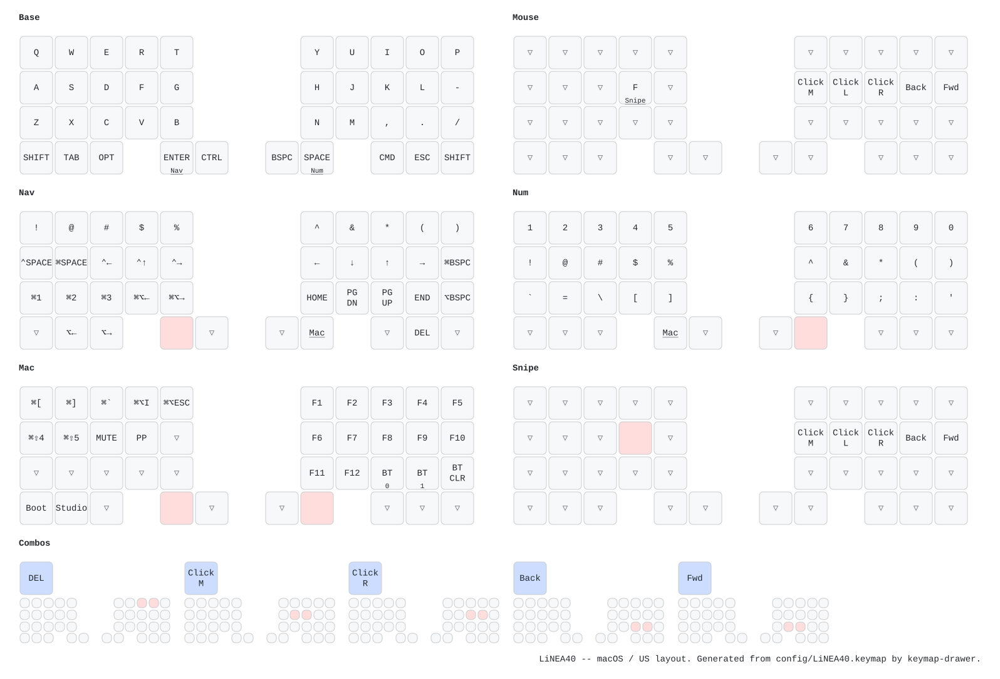

# zmk-config-LiNEA40

ZMK firmware configuration for **LiNEA40** — a 40-key split keyboard on two
Seeeduino XIAO BLE controllers, with an EC11 encoder on the left half and a
PMW3610 trackball on the right. Both sit in the bottom row, which is why that
row carries five keys per half rather than six.

The keymap targets **macOS with a US input source**.

## Keymap cheat sheet



Generated from `config/LiNEA40.keymap` by
[keymap-drawer](https://github.com/caksoylar/keymap-drawer) — see
[Regenerating](#regenerating-the-cheat-sheet) below.

### How the modifiers are placed

Ctrl sits on the **left** thumb, because its common partners are right-hand
letters: `^P`, `^N`, `^H`, `^K`. Cmd wants the mirror of that — `⌘C`, `⌘V`,
`⌘X`, `⌘Z`, `⌘A`, `⌘S`, `⌘W`, `⌘Q`, `⌘T`, `⌘F` are all left-hand — so it sits
on the **right** hand, on the bottom-row middle finger. It gave the right thumb
up to Bspc and Enter: Cmd is held rather than tapped, so it tolerates the worse
position, and those two — one per conversion in Japanese — do not.

Bspc, Ctrl, Cmd, Tab, Alt, Esc and both Shifts are plain keys. Only two keys
carry a layer, and both are the ones a thumb rests on: **Space holds Num** and
**Enter holds Nav**. Holding both gives Mac.

That is what lets Num and Nav put a full ten-key row under the fingers — a
thumb hold leaves all ten free, where a finger-held layer key blocks its own
column. It is also why `Tab`, `Alt` and `Esc` got plain keys back.

Nav rides on Enter rather than Bspc. Holding one of these keys after a pause
gives its layer rather than a repeat, which costs nothing on Enter — nobody
holds it — but broke Bspc, where holding to repeat a delete is the whole point.

Shortcuts whose chord never varies get a single key on a layer instead of a
layer-plus-modifier pile — Spotlight, input-source switch, `⌘1`–`⌘3`,
`⌘⌥←`/`⌘⌥→` for browser tabs and `⌃←`/`⌃→` for macOS spaces. The Emacs-style
cursor chords (`^P` `^N` `^B` `^F` `^A` `^E` `^H` `^D` `^K`) stay real Ctrl
chords, since they are used while typing.

`^Space` cannot be pressed as a chord — Ctrl and Space share the left thumb —
so it has its own key on the Nav layer. It was a combo on both thumb keys at
first, which was a mistake: a key in a combo has its press captured, so every
space was delayed, and a slightly wide thumb press switched the input source
instead of typing one.

### Layers

| # | Name | Entered by | Contents |
|---|------|-----------|----------|
| 0 | Base | — | US alpha block, `-` and `/` on the right pinky column |
| 1 | Mouse | trackball movement (`automouse-layer`) | click cluster on the right home row |
| 2 | Nav | right thumb (Enter) held | symbol row, arrows on `hjkl`, page/line jumps |
| 3 | Num | left thumb (Space) held | number row, symbols beneath it; also `scroll-layers` |
| 4 | Mac | both thumbs held together | F-keys, Bluetooth, bootloader, occasional app shortcuts |
| 5 | Snipe | left index held on the Mouse layer | trackball precision (`snipe-layers`) |

The Num layer is a real number row. A thumb holds it, so the digits span both
hands across the top, their shifted forms line up column for column directly
beneath, and the leftovers sit on a third row:

```
1  2  3  4  5      6  7  8  9  0
!  @  #  $  %      ^  &  *  (  )
`  =  \  [  ]      {  }  ;  :  '
```

Shift covers what is left: `~` from `` ` ``, `+` from `=`, `|` from `\`, `"`
from `'`, and on the base layer `_` from `-` and `?` from `/`.

Twenty-six letters plus `,` and `.` fill 28 of the 30 alpha keys, so the right
pinky column has exactly two slots for punctuation and three candidates. `-`
takes one — it types the Japanese long vowel mark and turns up about as often as
a letter — and `/` the other. `;` is the one that loses: it and `:` sit on the
Num layer next to each other, so each is a thumb hold plus a key rather than a
hold plus Shift plus a key. `_` needs no key of its own, being Shift and `-`.

Nav's top row is the shifted number row, in the same columns as Num's digits:
hold the **left** thumb for a digit, the **right** thumb for the symbol above
it. Num keeps its own copy one row down, so either thumb reaches them. What the
symbol row displaced — screenshots, DevTools, force quit, browser history,
same-app window switching, mute and play — moved to the Mac layer, whose left
hand was empty.

The Nav arrows sit on `h j k l` — the keys and fingers Vim uses, h included as
the index stretch. A thumb holds the layer, so the whole right hand stays free
for them. Shift and Cmd stay transparent on Nav so that shift-arrow and
cmd-shift-arrow keep selecting text.

Space, Bspc and Enter all sit under a thumb, which is what Japanese input wants
— space to convert, Enter to commit, Bspc to fix. Cmd took the bottom-row
position they needed: it is held rather than tapped, so it tolerates the worse
spot.

Space being a layer-tap is the one place the layout accepts real risk, and it
uses `tap-preferred` for it: no other keypress can turn its tap into a hold, so
a space never goes missing however fast the next letter follows. The trade is
that reaching Num means holding Space for the full tapping term.

Layers 1, 3 and 5 are also referenced by the trackball in
`config/boards/shields/LiNEA40/LiNEA40_right.overlay`; keep the two in sync
when renumbering.

## Building

Firmware is built by GitHub Actions on every push; download the `firmware`
artifact from the run and flash the `.uf2` files. Studio is enabled on the
right (central) half only.

### If flashing appears to change nothing

Studio brings `ZMK_KEYMAP_SETTINGS_STORAGE` with it
(`ZMK_STUDIO_RPC` selects it), which makes the keymap live in the board's
settings partition. `keymap.c` loads that over the compiled-in keymap at boot,
so once a keymap has been saved from Studio it wins over every later flash —
the new firmware goes on and the old keymap keeps running.

Flash the `settings_reset` build to **both** halves first, then flash the real
firmware. That clears Bluetooth pairings too, so unpair the keyboard on the
host and let the halves find each other again afterwards.

Two other things worth knowing when a key behaves unexpectedly:

- The central half holds the whole keymap; the peripheral only reports key
  positions. Flashing only the left half changes nothing about the keymap.
- The bottom row moved a lot from the pre-macOS keymap — Space and Backspace in
  particular swapped halves — so an old muscle-memory press lands somewhere
  genuinely different rather than on a broken key.

To build locally against a ZMK tree in a dev container:

```sh
make build container_name=<your container>
```

## Regenerating the cheat sheet

```sh
make draw
```

This creates a local virtualenv (`.venv-keymap-drawer/`, git-ignored) and
rewrites `keymap-drawer/LiNEA40.yaml` and `keymap-drawer/LiNEA40.svg`. Drawing
settings live in `keymap_drawer.config.yaml`. Run it after editing the keymap
and commit the result.
